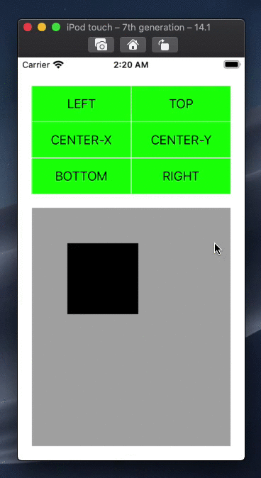

# Example iOS application for LayoutExtension

The example app presents how to use LayoutExtension library to create views using constraints and how to use them for animations. Source code is available in [LayoutExtension/ViewController.swift](LayoutExtension/ViewController.swift) file.

